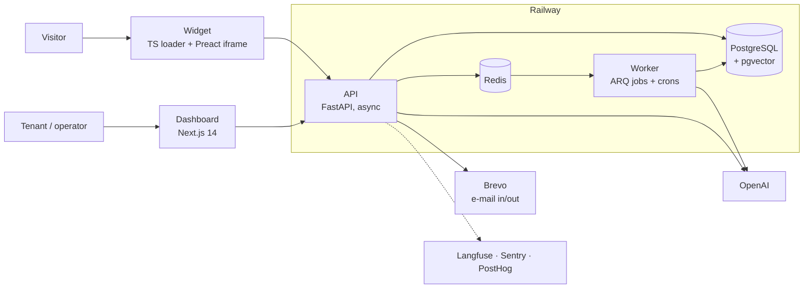

# Chat9 — Your Support Mate, Always On

**AI-powered support bot platform. Upload your docs, get a chat widget, your customers get instant answers — 24/7.**


Chat9 is a multi-tenant SaaS in production: a company (a *tenant*) connects its documentation, gets an embeddable widget, and its visitors get grounded answers in their own language. When the bot cannot help, the conversation moves to a human operator without leaving the widget.

| | |
|---|---|
| **Product** | https://getchat9.live |
| **API reference (Swagger)** | https://api.getchat9.live/docs |

---

## What it does

- **Knowledge ingestion** — PDF, Markdown, DOCX, plain text, OpenAPI specs (indexed per operation, not as raw text) and crawled documentation sites with scheduled refresh
- **Grounded answers** — hybrid retrieval over the tenant's corpus; the bot answers only from sources, asks one focused question when a detail is missing, and cites what it used
- **Any language** — replies follow the visitor's language; there are no per-language rules anywhere in the pipeline
- **Human handoff** — the bot offers a ticket when it cannot answer; operators take the chat live from the inbox, the bot stays muted while a human holds it, and replies by e-mail return to the conversation
- **Gap Analyzer** — finds under-covered topics in the docs and clusters questions the bot failed on into a backlog, with draft articles to close each gap
- **Identified sessions** — optional HMAC-signed visitor identity from the tenant's backend
- **Bring your own OpenAI key** — each tenant's key is encrypted at rest; token cost stays with the tenant

---

## Architecture



A chat turn goes through a fixed pipeline: injection guard → relevance guard → retrieval → generation → post-generation checks, streamed to the widget over SSE. Anything that should survive a deploy or be retried — crawls, embeddings, Gap Analyzer runs, e-mail — runs on the worker.

---

## Engineering highlights

- **Hybrid retrieval** — pgvector similarity and BM25 fused with Reciprocal Rank Fusion, then reranked by a per-tenant strategy (heuristic, LLM or cross-encoder) under a hard timeout with heuristic fallback. A reliability score built from overlap and contradiction evidence decides whether to answer, clarify or hand off ([`backend/search/`](backend/search/)).
- **Two-level prompt-injection guard** — a structural check, then a semantic one, before any generation; a relevance guard keeps the bot on the tenant's domain ([`backend/guards/`](backend/guards/)).
- **PII never reaches the model** — structural redaction of e-mails, phones, cards, IPs, tokens and keys at the model egress boundary, while operators still see the original text ([`backend/chat/pii.py`](backend/chat/pii.py)).
- **Prompt caching by design** — the system prompt is byte-stable across turns so the provider cache prefix holds; request-specific context goes after it.
- **Escalation state machine** — explicit requests for a human escalate at once; bot-initiated handoffs ask the visitor first and do not fire on a single weak answer ([`backend/escalation/`](backend/escalation/)).
- **Async end to end** on the critical chat path: `AsyncSession`, `AsyncOpenAI`, SSE streaming that releases its DB connection before the stream starts.
- **Answer-quality evals** — golden datasets run against a live bot and are graded with deterministic metrics plus Claude as LLM-as-judge, nightly and on demand ([`backend/evals/`](backend/evals/)).
- **Deploy safety** — CI rejects a second Alembic head, the OpenAPI schema is generated from code rather than fetched from a running API, and model prices are checked for drift.

---

## Repository layout

```
backend/            FastAPI app, one folder per domain (routes.py + service.py + schemas.py)
  chat/             chat pipeline, prompts, language handling, PII redaction
  search/           hybrid retrieval, fusion, reranking, reliability
  guards/           injection and relevance guards
  escalation/       handoff state machine
  operator/         live operator takeover
  gap_analyzer/     documentation-gap detection
  evals/            answer-quality eval CLI
  migrations/       Alembic
frontend/           Next.js dashboard and marketing site
  apps/widget-*     widget loader and iframe app (Vite + Preact)
tests/              pytest: SQLite through the app, pgvector integration in tests/pgvector_tests/
docs/               design docs and runbooks (docs/docs-ru/ — product docs in Russian)
```

---

## Quick start (self-hosted)

Prerequisites: Python 3.11+, Node.js 18+, Docker.

```bash
docker compose up -d db                 # PostgreSQL + pgvector

python -m venv venv && source venv/bin/activate
pip install -r requirements.txt
cp .env.example .env                    # fill in the values below
alembic upgrade head
uvicorn backend.main:app --reload       # http://localhost:8000

cd frontend
npm install
cp .env.local.example .env.local        # NEXT_PUBLIC_API_URL=http://localhost:8000
npm run dev                             # http://localhost:3000
```

### Environment variables

| Variable | Layer | Description |
|----------|-------|-------------|
| `DATABASE_URL` | Backend | PostgreSQL connection string |
| `JWT_SECRET` | Backend | Secret for JWT (min 32 chars) |
| `ENCRYPTION_KEY` | Backend | Fernet key for tenant OpenAI key encryption |
| `ENVIRONMENT` | Backend | `development` or `production` |
| `FRONTEND_URL` | Backend | Dashboard URL |
| `CORS_ALLOWED_ORIGINS` | Backend | Allowed dashboard origins |
| `AUTH_COOKIE_DOMAIN` | Backend | Parent cookie domain shared by dashboard and API |
| `AUTH_COOKIE_SAMESITE` / `AUTH_COOKIE_SECURE` | Backend | Auth cookie policy (`lax` / `true` in production) |
| `EMAIL_FROM`, `BREVO_API_KEY` | Backend | Transactional e-mail via Brevo |
| `ANTHROPIC_API_KEY` | Backend (optional) | LLM-as-judge for evals only, not used at runtime |
| `NEXT_PUBLIC_API_URL` | Frontend | Backend API base URL |

There is no global `OPENAI_API_KEY`: each tenant adds its own key in the dashboard.

---

## Testing and CI

```bash
ruff check backend
make smoke          # fast P0 regression
make test-sqlite    # full suite without Docker
make test           # SQLite + pgvector (needs the db container)
```

Tests drive real requests through the FastAPI app; only the network edge (OpenAI, Langfuse) is stubbed. Retrieval quality is asserted against real pgvector. Grouped suites and the eval workflow are described in [`docs/06-developer-test-runbook.md`](docs/06-developer-test-runbook.md).

GitHub Actions ([`.github/workflows/`](.github/workflows/)) run lint, the test suite, the frontend build and a migration-head check on every PR, plus nightly answer-quality evals and a widget smoke test.

---

## Embedding the widget

```html
<script>window.Chat9Config={widgetUrl:"https://getchat9.live"};</script>
<script
  src="https://widget.getchat9.live/widget.js"
  data-bot-id="ch_YOUR_PUBLIC_ID">
</script>
```

`data-bot-id` is the bot's public id from the dashboard and is safe to ship in page HTML. The loader adds an iframe that talks to `POST /widget/chat` and streams the answer over SSE.

---

## Documentation

- [`docs/04-features.md`](docs/04-features.md) — feature specs and expected behaviour
- [`docs/09-gap-analyzer.md`](docs/09-gap-analyzer.md) — Gap Analyzer design
- [`docs/07-observability-rollout.md`](docs/07-observability-rollout.md) — tracing, errors and product metrics
- [`AGENTS.md`](AGENTS.md) — architecture conventions and deployment safety rules

---

## License

Source-available under the [PolyForm Noncommercial License 1.0.0](LICENSE). You may read, run and modify the code for noncommercial purposes only. Commercial use requires a separate license from the author.
